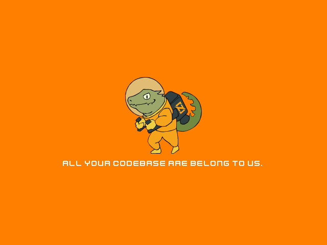

# zig-sdl-playground
⚡ my zig playground with SDL2



## Dependencies

- [zig](https://ziglang.org/) 0.10.0
- [vcpkg](https://github.com/microsoft/vcpkg)
    - sdl2
    - sdl2-image
    - sdl2-mixer\[libvorbis]
    - sdl2-ttf

## Assets

- texture: [ziglang/logo - Zero the Ziguana](https://github.com/ziglang/logo)
- sound: [Sci-Fi Sounds](https://www.kenney.nl/assets/sci-fi-sounds)
- font: [Kenney Fonts - Kenney Future](https://www.kenney.nl/assets/kenney-fonts)

## Build and Run

```
zig build run
```
